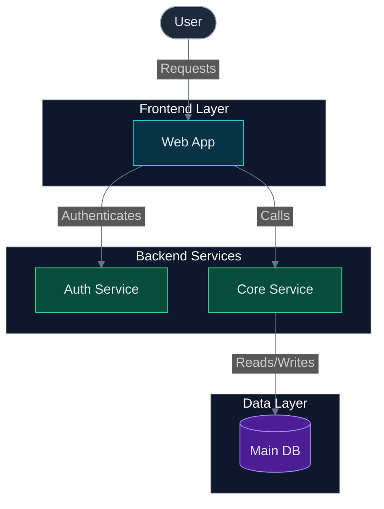

# Architecture Diagram

Use this optional Markdown artifact for one durable Mermaid architecture, module, feature, workflow, process-flow, user journey, sequence, state, or domain diagram when the selected output set includes `mermaid`. SVG is the default diagram output and lives under `devspec/architecture/images/`; HTML is optional and lives under `devspec/architecture/html/`. Keep diagram status in `devspec/architecture/artifact-queue.md`; keep generated content references, supporting evidence, assumptions, and maintenance notes here when this Markdown artifact is created.

## Resume State

| Field | Value |
| --- | --- |
| Current stage | diagram |
| Current command | `/devspec.diagram` |
| Current agent | devspec.diagram |
| Run status | See `devspec/glossary.md#run-status-values` |
| Current item | |
| Last completed step | |
| Next required action | |
| Pending user question | |
| Question options and examples | |
| Custom Answer entry or response | |
| Recommended option and justification | |
| Continuation condition | |
| Resume command | `/devspec.diagram` |
| Resume notes | |
| Updated | |

## Diagram Metadata

| Field | Value |
| --- | --- |
| ID | |
| Display title | `DIA-NNN - <Title Case Diagram Name>` |
| Scope | architecture, module, feature, workflow, user-journey |
| Diagram type | flowchart, sequenceDiagram, journey, stateDiagram, classDiagram, erDiagram, gantt, quadrantChart, mindmap, timeline |
| Audience | developers, architects, security reviewers, operators, stakeholders, or user-provided audience |
| Purpose | runtime flow, deployment, security, dependencies, data movement, integration, or user-provided goal |
| Architecture style | monolith, microservices, event-driven, serverless, agentic workflow, multi-repo, cloud-native, or user-provided style |
| Output format | mermaid, svg+mermaid, html+mermaid, or svg+html+mermaid |
| Mermaid declaration | flowchart TD, flowchart LR, flowchart BT, sequenceDiagram, journey, stateDiagram-v2, classDiagram, erDiagram, gantt, quadrantChart, mindmap, timeline |
| SVG target | `devspec/architecture/images/dia-NNN-<diagram-name>.svg` when output format includes svg |
| HTML target | `devspec/architecture/html/dia-NNN-<diagram-name>.html` when output format includes html |
| Subject | `dia-NNN-<diagram-name>` |
| Confidence | observed, high-confidence, low-confidence |
| Tags | |
| Queue row | `devspec/architecture/artifact-queue.md#diagram-queue-register` |

When a request uses the structured architecture-diagram prompt format and the selected output set includes `mermaid`, reflect the provided system name, architecture style, purpose, audience, actors, components, stores, flows, boundaries, design rules, and output format in this metadata, the queue row notes, source evidence and assumptions, and generated diagram content. If the request uses structured non-architecture diagram input, reflect the matching sequence, state/lifecycle, domain model, journey, timeline/gantt, quadrant, or mindmap fields in this metadata, the queue row notes, source evidence and assumptions, generated Mermaid content, and any SVG or HTML companion output. If the request omits output format, use SVG-only output and do not create this Markdown artifact.

## Mermaid Diagram

- Include this section only when the selected output set includes `mermaid`. SVG-only and HTML-only output should not create this Markdown artifact.
- Keep durable `DIA-*` IDs and `dia-NNN-*` subjects in metadata and filenames only; Mermaid content uses simple internal naming.
- Use short alphanumeric node IDs, double-quoted node labels of 1-4 words, and 2-3 word edge labels. Do not use `\n` or ` ` inside node labels or edge labels.
- Keep architectural flowcharts focused on one primary domain at macro level, structurally unidirectional, and adjacent by layer. Do not include overloaded graphs, cross-layer arrows, decision diamonds, UI micro-interactions, or return/error paths unless the diagram is explicitly an algorithm or activity flowchart.
- Use `sequenceDiagram` for exact step-by-step request and response behavior. Sequence diagrams should show happy-path messages between distinct participants, collapse pass-through API client helpers, and use method names for message labels.
- Keep runtime communication and compile-time project dependencies in separate diagrams. Logical architecture diagrams exclude SDLC actors and build artifacts, and keep owned application databases inside the system boundary.
- Avoid API, Swagger, tech stack, version, library, hosting, and framework boilerplate details in flowchart nodes unless the diagram is specifically about startup, request-pipeline, infrastructure-layer, or physical deployment behavior.
- Apply the Mermaid Visual Quality Pattern: (1) open flowcharts with the dark theme init block, (2) declare `classDef` entries for every role present, (3) use role-appropriate node shapes, (4) wrap boundaries of 3+ nodes in named `subgraph` blocks, (5) draw cross-subgraph arrows after all `end` keywords, (6) assign `classDef` classes in a batch block at the end, (7) keep node count <= 15.
- Mermaid renderers may ignore dark theme initialization for some families or hosts. When that happens, keep Mermaid portable and use the SVG or HTML companion as the canonical architecture-style visual output.

## Companion Outputs

- Use this section when `Output format` includes `svg` or `html`.
- Store the durable SVG at `devspec/architecture/images/dia-NNN-<diagram-name>.svg`.
- Store optional standalone HTML at `devspec/architecture/html/dia-NNN-<diagram-name>.html`.
- Select SVG templates from `.github/prompts/PATTERNS.md#svg-output-pattern`: `architecture-diagram.svg`, `process-flow-diagram.svg`, `sequence-diagram.svg`, `state-lifecycle-diagram.svg`, `domain-model-diagram.svg`, `journey-map-diagram.svg`, `timeline-plan-diagram.svg`, `quadrant-analysis-diagram.svg`, or `mindmap-diagram.svg`. Every template must preserve the shared dark architecture-style visual contract unless a documented constraint requires a smaller custom SVG.
- Generated SVG must be standalone XML with inline styles and no external assets, `<script>`, `<iframe>`, `<foreignObject>`, remote fonts, remote images, secrets, credentials, internal-only URLs, or unresolved placeholders.
- Generated HTML must be standalone static HTML with inline styles and no external assets, `<script>`, `<iframe>`, remote fonts, remote images, secrets, credentials, internal-only URLs, or unresolved placeholders.
- Validate the SVG as XML before reporting generation complete.

| Field | Value |
| --- | --- |
| SVG target | |
| HTML target | |
| Template used | `devspec/architecture/_template/<selected-svg-template>.svg` and optional `devspec/architecture/_template/diagram.html` |
| Validation | pending |

## Source Evidence and Assumptions

Use `evidence` for directly supported code, docs, config, ADRs, or user-confirmed facts. Use `assumption` only when the diagram depends on an inference that is not fully confirmed.

| Type | Source or assumption | Diagram impact | Resolution |
| --- | --- | --- | --- |
| evidence |  |  | confirmed |
| assumption |  |  | open |

## Maintenance Notes

| Note | Action or owner | Resolution state |
| --- | --- | --- |
|  |  | open |
